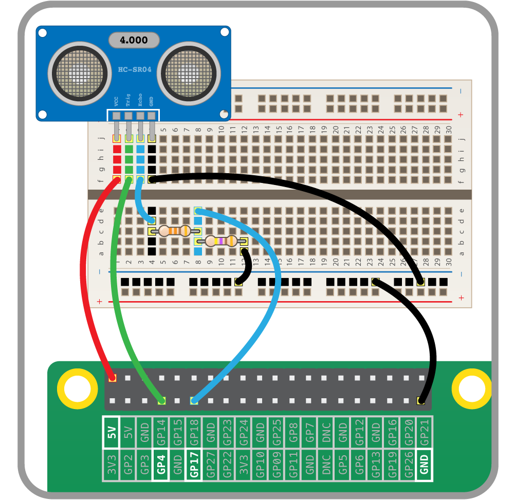

# Introduction
Mesure distance 



Follow link below for pin connections 
[https://projects.raspberrypi.org/en/projects/physical-computing/14](https://projects.raspberrypi.org/en/projects/physical-computing/14)


# Code

## 1- Power your raspberry

You can achive it with connecting it to your pc trought the Micro USB Port of the raspberry pi


## 2- Connect to your raspberry pi
Using putty if you're on windows, Ssh if you're on a linux based os
Follow the following instruction if you dont know how to connect to raspberry pi
[Connect to Raspberry Pi using Putty](https://github.com/ionoid-io-projects/workshop/blob/master/doc/od-iot-raspbian-rpi-zero-windows.md#5-first-boot)

## 3- Download the binary file

Assuming you're connected with... copy and past this command
If you're using Raspberry zero
```
curl -O https://raw.githubusercontent.com/ionoid-io-projects/workshop_ultrasonic_distance_sensor/master/bin/arm6/udistance
```

If you're using Raspberry 3 b
```
curl -O https://raw.githubusercontent.com/ionoid-io-projects/workshop_ultrasonic_distance_sensor/master/bin/arm7/udistance
```
## make it executable
```
chmod +x udistance
```

## 4- execute binary to make led blink
```
./udistance
```

## How to stop the program
To quit or stop the program click on **Ctrl+C**


Congratulation.

## For explanation
[https://www.modmypi.com/blog/hc-sr04-ultrasonic-range-sensor-on-the-raspberry-pi](https://www.modmypi.com/blog/hc-sr04-ultrasonic-range-sensor-on-the-raspberry-pi)

## Other references

[https://pimylifeup.com/raspberry-pi-distance-sensor](https://pimylifeup.com/raspberry-pi-distance-sensor/)
[http://espace-raspberry-francais.fr/Composants/](http://espace-raspberry-francais.fr/Composants/Mesure-de-distance-avec-HC-SR04-Raspberry-Francais/)
[https://github.com/rhiller/pi-distance](https://github.com/rhiller/pi-distance)